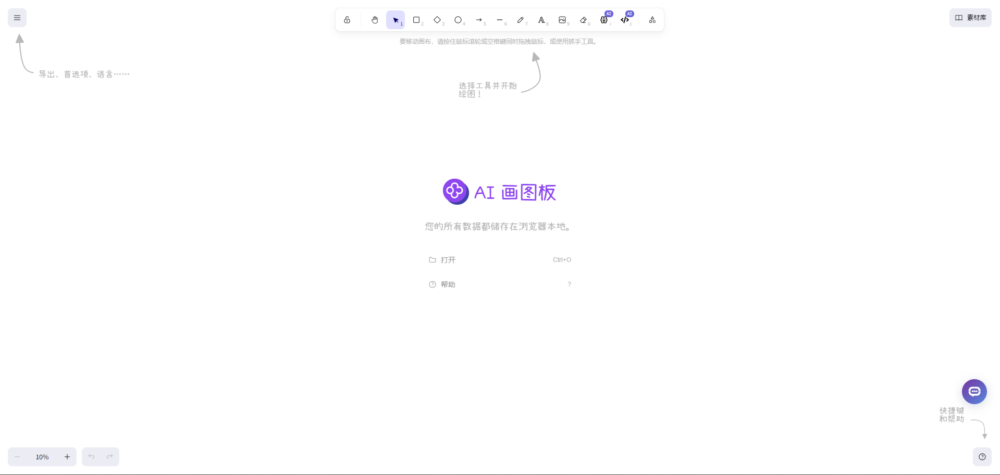
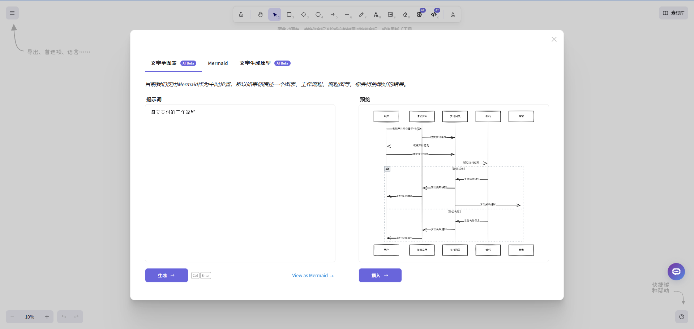
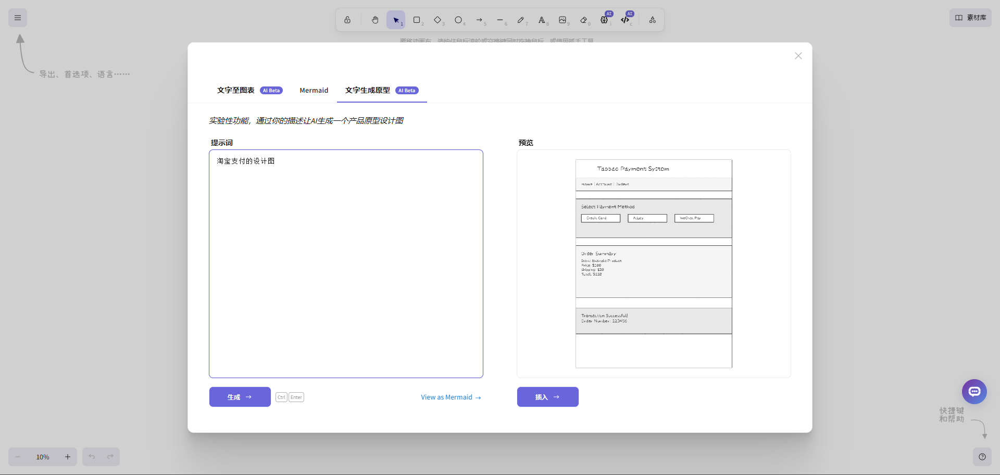

# 
✏️ AI Whiteboard 🚀✨

Quickly create sketches on a whiteboard using AI

<a href="README_zh.md">中文</a> | <a href="README.md">English</a> | <a href="README_ja.md">日本語</a>

This is the open-source version of [AI Whiteboard](https://302.ai/tools/whiteboard/) from [302.AI](https://302.ai).
You can log in directly to 302.AI to use the online version with zero code and zero configuration.
Alternatively, you can modify this project according to your needs, input 302.AI's API KEY, and deploy it yourself.

## Interface Preview
Quickly create and edit sketches on a whiteboard using AI, supporting various drawing tools and AI-assisted functions.

## Project Features
### 🖌️ Excalidraw Core Functions
   - Rich drawing tools: including pencil, shapes, text, etc.
   - Collaborative editing: supports real-time collaboration among multiple users
   - Export/Import: supports export and import in various formats

### 🤖 AI-Enhanced Functions
   - AI chart generation: generate charts based on text descriptions
   - AI prototype generation: generate prototypes based on text descriptions
   - Wireframe to code: provide HTML code generation for selected charts

### 🎨 Custom Styles
   - Rich color selection
   - Various line styles
   - Custom fonts

### 🌍 Multi-language Support
  - Chinese interface
  - English interface
  - Japanese interface
  - And many other international languages

With AI Whiteboard, we can quickly create professional-level design sketches, flowcharts, prototypes, etc., greatly improving work efficiency. AI not only assists in drawing but also sparks creativity, providing new ideas and inspiration for design. 🎉💻 Let's explore the new world of AI-driven creativity together! 🌟🚀

## 🚩 Future Update Plans
- [ ] Update more background styles and templates
- [ ] Add batch processing functionality

## Tech Stack
- React
- Excalidraw

## Development & Deployment
1. Clone the project `git clone https://github.com/302ai/302_whiteboard`
2. Install dependencies `yarn install`
3. Configure 302's API KEY (refer to .env.example)
4. Run the project `yarn run dev`
5. Build and deploy `docker build -t whiteboard . && docker run -p 3000:3000 whiteboard`

## ✨ About 302.AI ✨
[302.AI](https://302.ai) is an AI application platform for enterprises, with pay-as-you-go pricing, ready to use out of the box, and an open-source ecosystem. ✨
1. 🧠 Combines the latest and most comprehensive AI capabilities and brands, including but not limited to language models, image models, voice models, and video models.
2. 🚀 Conducts deep application development on basic models, developing real AI products rather than simple chatbots.
3. 💰 Zero monthly fees, all functions are pay-per-use, fully open, achieving truly low barriers and high ceilings.
4. 🛠 Powerful management backend, aimed at teams and SMEs, managed by one person, used by many.
5. 🔗 All AI capabilities provide API access, and all tools are open-source and customizable (in progress).
6. 💡 Strong development team, launching 2-3 new applications every week, with daily product updates. Developers interested in joining are welcome to contact us.